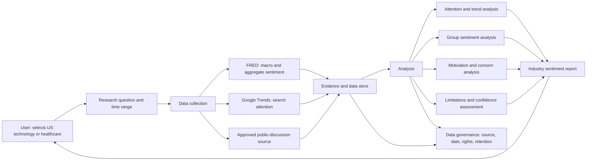

# System Architecture

- Version: v0.1
- Status: Draft
- Updated: 2026-08-23

## 1. Purpose

Build an industry-sentiment research system for the US technology and healthcare sectors. The system uses online, existing data to identify group-level attention, attitudes, motivations, concerns, and changes over time.

The system is not an investment-advice engine and does not determine any individual’s psychological state.

## 2. Architecture overview

## 3. Core modules

### 3.1 Research input

The user selects one of the first two industries, defines a research question, and chooses a time range. Example questions include:

- Is public interest in the US technology industry rising or falling?
- What concerns are most visible around the US healthcare industry?
- Has the overall tone become more optimistic, cautious, or negative?

### 3.2 Data collection

The collection module retrieves only approved, online data sources:

- FRED and permitted published aggregate sentiment indicators.
- Google Trends search-interest signals.
- A public-discussion source only after its access, terms, privacy, retention, and AI-use rules are approved.

### 3.3 Evidence and data store

Every collected item must preserve:

- Source and source type.
- Retrieval date and the period represented.
- Industry, query, and geographic scope.
- Required attribution, rights, and retention rule.
- The distinction between an observed data point and an AI interpretation.

### 3.4 Analysis

The analysis module produces group-level findings only:

- Attention and search-interest changes.
- Macro and published consumer-sentiment context.
- Publicly expressed positive, cautious, and negative themes.
- Recurring motivations, concerns, and unresolved questions.
- Confidence assessment based on source quality, amount, consistency, and coverage.

The module must not profile individuals, infer private traits, or present a public-discussion sample as the view of all people.

### 3.5 Reporting

The report module presents a source-backed industry view containing:

- Scope and research question.
- Attention and sentiment trend.
- Positive, cautious, and negative themes.
- Main motivations and concerns.
- Evidence, sources, dates, and confidence limits.
- What should be monitored next.

## 4. Data governance

Data governance applies to every module:

- Use only permitted sources and access methods.
- Keep the minimum data needed for the stated research purpose.
- Respect source attribution, rate limits, retention, and deletion requirements.
- Keep credentials outside source control.
- Make data limitations visible in user-facing reports.

## 5. Development order

1. Define the data schema and evidence model.
2. Build FRED and Google Trends collection.
3. Build evidence storage and research-project management.
4. Build trend and aggregate-sentiment analysis.
5. Build the industry report.
6. Add an approved public-discussion integration after compliance review.

## Change log

| Version | Date | Change |
| --- | --- | --- |
| v0.1 | 2026-08-23 | Initial system architecture for the industry-sentiment MVP. |
