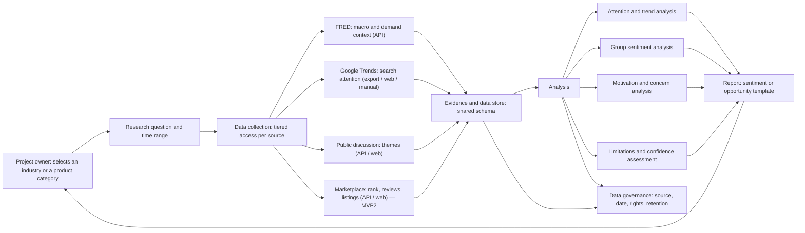

# System Architecture

- Version: v0.2
- Status: Draft
- Updated: 2026-08-23

## 1. Purpose

Build a personal research system with a shared core and two report products:

1. **Industry Sentiment** — US technology and healthcare industries. Built first.
2. **Product Opportunity** — US product categories and product ideas. Built second, on the
   same core.

Modules 3.2 to 3.4 are shared. Only the research input and the report layout differ
between the two. This document describes the core in terms of the first MVP, and marks
where the second reuses it.

The system serves the US technology and healthcare sectors first. The project owner uses it for investment research and product-development or product-selling decisions. The system uses online, existing data to identify group-level attention, attitudes, motivations, concerns, and changes over time.

The system is not an investment-advice engine and does not determine any individual’s psychological state.

## 2. Architecture overview

## 3. Core modules

### 3.1 Research input

The user selects one of the first two industries, defines a research question, and chooses a one-month or three-month lookback window. The report runs weekly. Example questions include:

- Is public interest in the US technology industry rising or falling?
- What concerns are most visible around the US healthcare industry?
- Has the overall tone become more optimistic, cautious, or negative?

### 3.2 Data collection

The collection module retrieves free online sources using the tiered access policy in
`docs/01_Product/00_Shared_Research_Foundation.md` section 3.1. Each collector declares
which tier it uses and records that tier on every stored record.

| Source | Access tier | MVP |
| --- | --- | --- |
| FRED and permitted published sentiment indicators | 1 — free API | Both |
| Google Trends | 2 or 3, falling back to 4 | Both |
| Public discussion | 1 where a free API exists, otherwise 3 | Both |
| Marketplace rank, reviews, listings | 1 where a free API exists, otherwise 3 | MVP2 |

Every collector implements the same adapter contract, so a source can move between tiers —
or be replaced — without touching the analysis or report layers. A collector that starts
being blocked drops to Tier 4 manual import rather than working around the block.

### 3.3 Evidence and data store

Every collected item conforms to the shared evidence schema
(`docs/01_Product/00_Shared_Research_Foundation.md` section 5), which fixes the source,
access method, period, geography, rights, retention, limitation, and the
observation / derived metric / interpretation distinction. An interpretation record that
does not name the records it rests on is invalid and is rejected at write time.

This store is shared by both MVPs.

### 3.4 Analysis

The analysis module produces group-level findings only:

- Attention and search-interest changes.
- Macro and published consumer-sentiment context.
- Publicly expressed positive, cautious, and negative themes.
- Recurring motivations, concerns, and unresolved questions.
- Confidence assessment by the shared rubric (shared foundation, section 6), which fixes
  when a finding is High, Medium, Low, or insufficient evidence.

The module must not profile individuals, infer private traits, or present a public-discussion sample as the view of all people.

### 3.5 Reporting

The report module renders whichever template applies, from the same evidence store. A
section whose source is not connected renders as insufficient evidence under the shared
gating rule, naming what is missing. The industry report contains:

- Scope and research question.
- Attention and sentiment trend.
- Positive, cautious, and negative themes.
- Main motivations and concerns.
- Evidence, sources, dates, and confidence limits.
- What should be monitored next.

## 4. Data governance

Data governance applies to every module:

- Use the highest available access tier for each source, and record which one was used.
- Keep no content behind a login, no personal data, and no stored full-text copies.
- Keep the minimum data needed for the stated research purpose.
- Respect source attribution, rate limits, retention, and deletion requirements.
- Keep credentials outside source control.
- Make data limitations visible in user-facing reports.

## 5. Development order

1. Implement the shared evidence schema and the collector adapter contract.
2. Build FRED collection (Tier 1) and Google Trends collection (Tier 2/3 with a Tier 4
   manual-import path, since Trends has no stable public API).
3. Build evidence storage and research-project management.
4. Build trend and aggregate-sentiment analysis, including the confidence rubric.
5. Build the industry report, with gated sections rendering as insufficient evidence.
6. Add the public-discussion collector, which ungates the attitude and motivation sections
   of both reports.
7. Add the marketplace collector and the product opportunity report — the second MVP,
   reusing modules 3.2 to 3.4 unchanged.

## Change log

| Version | Date | Change |
| --- | --- | --- |
| v0.1 | 2026-08-23 | Initial system architecture for the industry-sentiment MVP. |
| v0.2 | 2026-08-23 | Described the shared core serving both MVPs; replaced the approved-source model with the tiered access policy; added the marketplace collector and the Google Trends fallback path; adopted the shared evidence schema and confidence rubric. |
